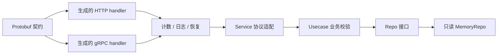

# Kratos 双协议只读目录服务

这是 081–090 题共同使用的完整教学服务：查询内置商品、返回明确错误、记录结构化调用日志和低基数计数，并由 Kratos App 管理 HTTP/gRPC 生命周期。内存仓储在构造后只读，数据重启后重新加载；它的功能范围是本地目录查询，不提供订单写入、持久化或生产认证。

## 运行

从仓库根目录执行：

```sh
go run ./examples/catalog/cmd/server
```

HTTP 默认监听 127.0.0.1:8000，gRPC 默认监听 127.0.0.1:9000。可用 `-http`、`-grpc` 更改地址。示例使用本地明文传输；对外部署需按实际环境配置 TLS、认证和诊断端点访问控制。

- `GET http://127.0.0.1:8000/v1/items/book` 返回商品 ID 与名称。
- `GET http://127.0.0.1:8000/v1/items/missing` 返回 404 与 `ITEM_NOT_FOUND`。
- `GET http://127.0.0.1:8000/metrics` 返回请求与失败累计计数；指标请求本身不计数。
- Ctrl+C 触发应用关停，最多等待配置的 5 秒停止预算。

## 验证

```sh
go test ./examples/catalog/... -count=1
go test -race ./examples/catalog/... -count=1
go vet ./examples/catalog/...
```

测试覆盖业务参数与预取消不访问仓储、运行中取消退出，以及本机真实 TCP 上的 HTTP/gRPC 成功与失败映射、指标计数、App.Stop 和 App.Run 返回。使用动态端口，无需数据库、Redis 或注册中心。它不验证外部存储、真实集群、故障切换或高负载性能。

## 请求链路



实现按职责分文件，保留在同一个小包中以便阅读，没有为示例增加无用装配层。真实大型工程可以按课程说明拆成 internal/service、internal/biz、internal/data。

## 固定版本与生成

- Kratos v2.9.1；gRPC Go v1.70.0；Protobuf Go v1.36.2，精确依赖见根目录 go.mod/go.sum。
- protoc 29.3；protoc-gen-go v1.36.2；protoc-gen-go-grpc 1.5.1；protoc-gen-go-http v2.9.2。
- 生成代码已提交，普通运行不要求安装生成器。
- 重新生成前准备上述版本并放入 PATH，再从仓库根目录运行 `python scripts/generate_proto.py`。脚本检查工具版本，从锁定 Kratos 模块获取官方注解目录。

生成器版本和运行库版本不是同一个概念，兼容性由生成代码的版本检查及真实构建验证。本项目不声称这些是当前最新版本。
